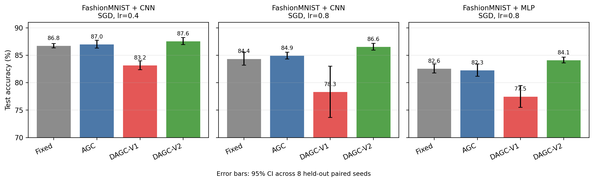

# Dynamics-Aware Gradient Clipping

Research implementation of **Dynamics-Aware Gradient Clipping: Protective Feedback for Unstable Training**.

DAGC adapts a global gradient-clipping threshold using recent clipping exposure
and consecutive-gradient alignment. DAGC-V2 strengthens clipping when exposure
exceeds a reference level. Experiments investigate its accuracy and protection
mechanism in unstable training with small CNN and MLP models.

## Method

The clipped gradient and controller update are

```text
clipped_gradient = min(1, c / (gradient_norm + epsilon)) * gradient
E = beta * E + (1 - beta) * indicator(gradient_norm > c)
A = beta_a * A + (1 - beta_a) * alignment
signal = relax * (reference - E) - osc_weight * max(0, -A)
c_next = project(c * exp(gamma * tanh(signal)), lower_bound, upper_bound)
```

The current threshold is applied before computing the next threshold. Bounds
track a rolling median of gradient norms. Full-gradient alignment is used by
the controller; random projections provide auxiliary diagnostics.

V2 uses the reference level as a sign-change threshold for protective feedback.
It does not track a target clipping rate. The original V1 controller remains
available by setting `exposure_target=None`.

The frozen V2 configuration is `init_c=0.5`, `gamma=0.05`, `beta=0.9`,
`relax=0.3`, `osc_weight=3.0`, and `exposure_target=0.1`.

## Installation

Python 3.10 or later is required. Install dependencies from the repository root:

```bash
python -m pip install -r requirements.txt
python -m pip install -e .
```

The published evaluation runners request a CUDA device. Install a compatible
PyTorch build for your GPU. Dataset loaders download data into `data/` on first
use. For a CPU smoke run, use `train_run` with `device="cpu"`.

## Using DAGC-V2

```python
from src.train import train_run

result = train_run({
    "dataset": "fashion_mnist",
    "model": "small_cnn",
    "optimizer": "sgd",
    "device": "cuda",
    "data_dir": "data",
    "seed": 900,
    "epochs": 15,
    "batch_size": 256,
    "lr": 0.8,
    "momentum": 0.9,
    "weight_decay": 1e-4,
    "num_workers": 0,
    "train_size": 5000,
    "test_size": 2000,
    "projection_dim": 8,
    "clipping": {
        "name": "dagc", "init_c": 0.5, "gamma": 0.05,
        "beta": 0.9, "relax": 0.3, "osc_weight": 3.0,
        "exposure_target": 0.1,
    },
})
print(result["test_acc"])
```

## Held-out evaluation

Each condition uses eight paired evaluation seeds, 5,000 training images,
2,000 test images, 15 epochs, batch size 256, and SGD with momentum 0.9.
Fixed thresholds are selected on separate calibration seeds. V2 is frozen after
its development comparison. AGC uses coefficient 0.01.

| Dataset / model | Learning rate | Fixed | AGC | DAGC-V1 | DAGC-V2 |
|---|---:|---:|---:|---:|---:|
| FashionMNIST / CNN | 0.4 | 86.76 ± 0.40 | 87.02 ± 0.70 | 83.18 ± 0.81 | **87.58 ± 0.63** |
| FashionMNIST / CNN | 0.8 | 84.38 ± 1.19 | 84.95 ± 0.63 | 78.35 ± 4.67 | **86.56 ± 0.61** |
| FashionMNIST / MLP | 0.8 | 82.59 ± 0.83 | 82.29 ± 1.12 | 77.51 ± 1.99 | **84.12 ± 0.52** |
| MNIST / CNN | 0.8 | 97.23 ± 0.43 | 96.84 ± 0.36 | 85.19 ± 7.41 | **98.39 ± 0.15** |

Values are test accuracy (%) with normal-approximation 95% confidence intervals.
Unclipped runs have divergence rates of 87.5%, 100%, 100%, and 75%, respectively.



```bash
python scripts/run_dagc_v2_evaluation.py --lr 0.8 --seeds 300 301 302 303 304 305 306 307
python scripts/run_dagc_v2_evaluation.py --lr 0.4 --seeds 308 309 310 311 312 313 314 315
python scripts/run_mlp_evaluation.py
python scripts/run_mnist_evaluation.py
python analysis/plot_dagc_v2_evaluations.py
```

Archived LR 0.8 CNN results are in `results/dagc_v2_evaluation/`; the current
runner writes to `results/dagc_v2_evaluation_lr0.8/`. The plotting script reads
the archived results. Other conditions use their corresponding evaluation
folders. Figures and aggregate data are in `results/figures/dagc_v2/`.

## Mechanism controls

The mechanism experiment separates calibration seeds 800–802 from evaluation
seeds 900–907. It compares eight policies using paired subsets, initialization,
and minibatch order. Calibration selects a fixed threshold by clipping-intensity
matching and produces a predetermined threshold schedule.

| Policy | Accuracy (%) | Mean clipping intensity |
|---|---:|---:|
| Full V2 | 86.79 ± 0.55 | 0.798 |
| No alignment | 86.63 ± 0.77 | 0.790 |
| No exposure | 81.33 ± 1.03 | 0.399 |
| Frozen multiplicative adaptation | 80.74 ± 0.86 | 0.346 |
| Approximately intensity-matched fixed | 85.61 ± 0.77 | 0.762 |
| Calibration-trace replay | 86.58 ± 0.46 | 0.789 |
| AutoClip, tenth percentile | 79.88 ± 1.44 | 0.232 |
| Specified rate-tracking analogue | 75.21 ± 1.57 | 0.160 |

V2 exceeds the matched fixed threshold by **1.18 ± 0.47 percentage points**
(7/8 wins). Its paired advantage over the no-alignment variant is only
**0.16 ± 0.41 points**, and over replay **0.21 ± 0.53 points**. These controls
support exposure-driven protective threshold profiles, while leaving the
necessity of direction feedback and the incremental benefit of online feedback
unestablished. AutoClip and rate tracking are specified configurations without
comprehensive tuning. The frozen variant retains moving scale bounds.

```bash
python scripts/run_v2_mechanism.py
```

See [the complete protocol](docs/mechanism_experiments.md). Raw CSVs, paired
summaries, the frozen calibration protocol, and per-run trajectory JSONs are
in [results/v2_mechanism](results/v2_mechanism/).

## Diagnostic studies

Earlier A3 and A4 experiments examine the original controller at stable learning
rates. A3 compares component removals; A4 contains 160 runs spanning datasets,
architectures, optimizers, and clipping policies. These serve as development
diagnostics and negative controls rather than V2 performance evidence.

```bash
python scripts/run_algorithm_benchmarks.py --suite a3
python scripts/run_algorithm_benchmarks.py --suite a4
python analysis/plot_algorithm_benchmarks.py
```

Results are in `results/a3_ablation_small/` and `results/a4_multiseed_small/`.
The reference-level sweep is available through `analysis/plot_tau_sweep.py`.

## Reproducibility

Runners reuse completed seed-policy pairs or saved per-run JSONs. Running an
unchanged protocol resumes safely; modified configurations require a fresh
output directory to avoid reusing cached outcomes. Paired intervals use seeds
as the unit of replication. Tests can be run with:

```bash
python -m pytest -q
```

The evidence covers short, small-subset MNIST-family experiments. It supports
claims within these protocols; it does not establish generalization to large
models or fully tuned superiority over every adaptive baseline.

## Repository layout

```text
src/         Training, clipping policies, models, and diagnostics
scripts/     Development, calibration, and evaluation entry points
analysis/    Statistical summaries and plots
configs/     Experiment configuration files
tests/       Unit tests
docs/        Protocol and implementation documentation
results/     Published experimental CSVs, logs, and figures
notebooks/   Interactive experiments
data/        Downloaded datasets (excluded from Git)
```

## Authors and license

Yuxin Li and Zisong Yuan. Released under the [MIT License](LICENSE).
